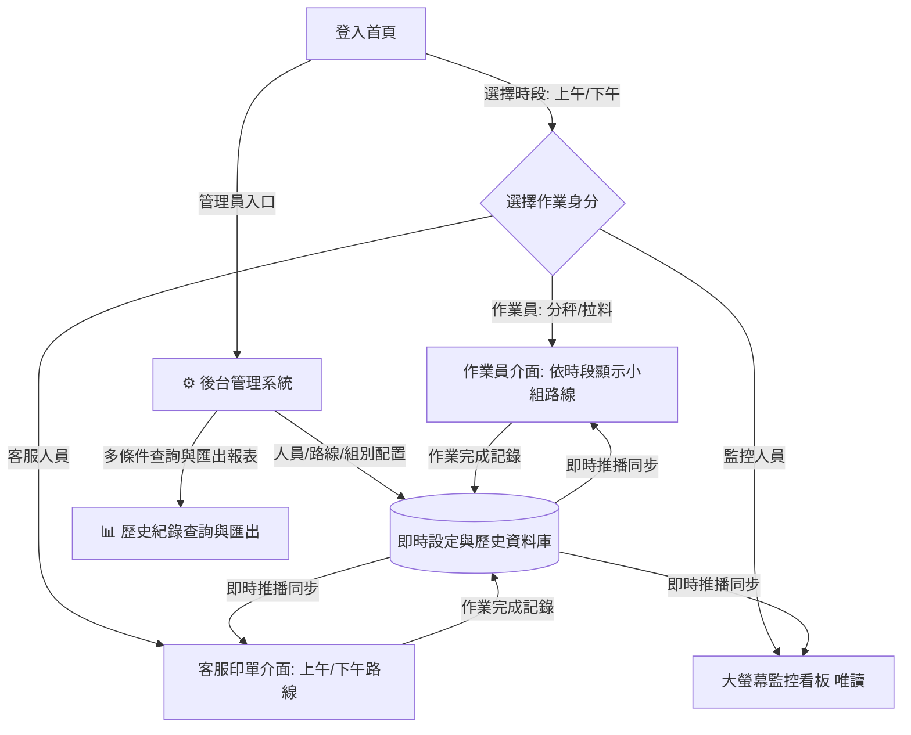

# 理貨連動狀態看板系統 — 功能擴充規格規劃書 (v3.0)

本規格書整合「**動態後台管理**」、「**唯讀大螢幕監控看板**」與「**歷史資料多維度查詢與匯出報表模組**」。

---

## 📌 一、 系統架構與資料流設計



---

## ⚙️ 二、 後台管理系統 (Admin Panel)

管理者可直接於介面即時調整人員、路線與組別，無須更動任何程式碼。

### 1. 權限與進入方式
- **入口位置**：登入首頁右上角點擊「⚙️ 後台管理」。
- **安全防護**：進入時可輸入簡易管理密碼，避免現場作業員誤觸。

---

### 2. 人員管理模組 (Staff Management)
* **核心設計（停用機制與拖曳排序）**：
  - ➕ **新增人員**：輸入姓名後立即生效。
  - ✏️ **編輯姓名**：直接修改人員姓名。
  - ⏸️ **狀態切換（啟用 / 停用）**：
    - **啟用狀態**：正常顯示於現場登入的人員選單中。
    - **停用狀態**：離職或當日未出勤人員一鍵標記為「停用」，登入選單中將自動隱藏，但**完整保留過去所有歷史操作紀錄**，未來亦可一鍵恢復啟用。
  - 🖱️ **滑鼠直接拖曳排序 (Drag & Drop)**：按住左側 `☰` 拖曳手把，直接上下拖曳即可調整人員在登入選單中的顯示順序（亦保留 ⬆️ ⬇️ 微調按鈕）。

---

### 3. 路線管理模組 (Route Management)
* **核心設計（時段大分類與拖曳排序）**：
  - **大分類**：區分為 **【上午路線】** 與 **【下午路線】** 兩大時段切換卡片。
  - **功能清單**：
    - ➕ **新增路線**：選擇時段（上午/下午）後，輸入路線代碼（例如：上午 `S1`, `P`, `K`；下午 `B`, `F`, `M2` 等）。
    - ✏️ **編輯代碼**：修改路線名稱/代碼。
    - ⏸️ **啟用/停用**：當日若特定路線未出車，可直接設為停用，作業介面與看板即時同步隱藏。
    - 🖱️ **滑鼠直接拖曳排序**：支援按住 `☰` 自由上下拖曳調整路線在看板與清單上的排列順序。

---

### 4. 組別管理模組 (Group Management)
* **核心設計（大分類上午/下午 ➜ 再分小組 ➜ 排他性指派與順序自訂）**：
  - **🚫 排他性單選分配（不可重複複選）**：
    - 同一時段同身分下，**每條路線僅能指派給一個小組**。
    - 已被其他組別選取的路線，標籤會自動標記為淺灰並顯示其所屬組別（例如：`S1 (組別1)`）；點擊時會跳出確認視窗詢問是否進行跨組移轉。
  - **🔀 方案 A：小組內路線自訂作業順位（① ② ③ 標籤左右拖曳）**：
    - 小組內已分配的路線會自動標示順序徽章：`① S1` ➜ `② P` ➜ `③ S2`。
    - 支援滑鼠**按住標籤直接左右拖曳**交換順序（或點擊標籤旁的 ◀ ▶ 箭頭微調）。
    - 點擊標籤右上角 `❌` 可隨時將路線移出本組。
  - **📱 作業員畫面完美連動**：
    - 現場作業員登入後，畫面上的大按鈕會**完全依照此順序由左至右、由上至下（#1, #2, #3）精準排列**，作業員依照編號順序作業即可。
  - **🖱️ 小組整行拖曳排序**：表格左側提供 `☰` 握把，可直接上下拖曳調整小組優先順序。

---

## 📊 三、 歷史資料查詢與匯出模組 (History & Export)

提供主管與管理人員調閱歷史作業紀錄、分析人員效率，並能一鍵匯出為 Excel/CSV 檔案。

### 1. 多維度複合篩選器 (Search Filters)
可自由組合以下條件進行精準查詢：
* 📅 **日期區間**：
  - 自訂【開始日期】～【結束日期】。
  - 快速選取捷徑：`今日`、`昨日`、`近 7 天`、`本月`。
* ⏰ **時段篩選**：`全部` / `上午 (AM)` / `下午 (PM)`。
* 👥 **作業組別**：`全部` / 指定特定分秤或拉料組別（例如：`上午-組別1`）。
* 👤 **作業人員**：`全部` / 指定特定人員姓名（例如：`林淑萍`）。
* 🚚 **路線代碼**：`全部` / 指定特定路線（例如：`S1`）。
* 🏷️ **作業身分/項目**：`全部` / `分秤完成` / `拉料完成` / `客服印單`。

### 2. 查詢結果展示表格 (Data Grid)
表格清楚呈現以下完整資訊，支援按時間升冪/降冪排序與分頁：

| 序號 | 日期 | 時間 | 時段 | 路線代碼 | 作業項目 | 所屬組別 | 操作人員 | 完成狀態 |
| :---: | :---: | :---: | :---: | :---: | :---: | :---: | :---: | :---: |
| 1 | 2026-10-04 | 08:35:12 | 上午 | S1 | 分秤 | 組別1 | 林淑萍 | 已完成 |
| 2 | 2026-10-04 | 08:48:20 | 上午 | S1 | 拉料 | 組別1 | 余姿旻 | 已完成 |
| 3 | 2026-10-04 | 08:52:00 | 上午 | S1 | 客服印單 | - | 王琇儀 | 已完成 |

### 3. 資料匯出與統計功能 (Export & Summary)
* 📥 **匯出 Excel (CSV / XLSX)**：
  - 一鍵將符合篩選條件的資料匯出為標準試算表，欄位齊全、中文編碼無亂碼（UTF-8 with BOM），方便進行工時計算與月報表製作。
* 📈 **即時統計摘要面板**：
  - 查詢後於上方顯示摘要小卡：
    - **總完成筆數**
    - **人員作業次數排行**（如：林淑萍 15 筆、余姿旻 12 筆...）
    - **路線平均完成耗時**
* 🖨️ **友善列印模式**：提供乾淨的報表排版，方便直接列印成紙本。

---

## 🖥️ 四、 唯讀監控看板模式 (Monitor Mode)

專為**主管辦公室、廠區大螢幕電視**打造，提供全方位的進度掌握，同時具備防呆機制。

### 1. 核心特色
1. **100% 唯讀安全防呆**：
   - 鎖定所有操作與按鈕點擊，大螢幕觸控或滑鼠點擊不會改變任何路線狀態。
2. **時段檢視切換**：
   - 提供「**全日總覽**」、「**上午時段**」、「**下午時段**」切換按鈕，亦可設定自動定時輪播。
3. **進度儀表板 (Progress Stats)**：
   - 即時計算當前時段的完成率：
     - ⚖️ **分秤進度**：例如 `8 / 10 路線 (80%)`
     - 📦 **拉料進度**：例如 `6 / 10 路線 (60%)`
     - 🖨️ **印單進度**：例如 `5 / 10 路線 (50%)`
4. **全路線狀態矩陣牆 (Status Matrix)**：
   - 大字體路線代碼，狀態一目了然：
     - 🟢 **綠色高亮**：已完成（清楚標示完成時間，如 `09:15:30`）。
     - ⚪ **灰色/橘色**：待處理 / 等待前置作業完成。
5. **即時動態滾動紀錄 (Live Logs Feed)**：
   - 側邊即時顯示最新操作動態（誰在幾點幾分完成了哪條路線的分秤/拉料/印單）。
6. **大螢幕電視展示優化**：
   - 支援 **F11 / 一鍵全螢幕**。
   - 高對比深色介面（Dark Theme），電視長時間播放清晰不刺眼。

---

## 🗄️ 五、 資料庫結構設計 (Data Schema)

升級後的資料庫架構（完整保留歷史歸檔，支援日後跨區間查詢）：

```json
{
  "config": {
    "users": [
      { "id": "u1", "name": "林淑萍", "active": true },
      { "id": "u2", "name": "余姿旻", "active": true },
      { "id": "u3", "name": "王小明", "active": false }
    ],
    "routes": {
      "morning": [
        { "id": "S1", "name": "S1", "active": true },
        { "id": "P", "name": "P", "active": true },
        { "id": "S2", "name": "S2", "active": true },
        { "id": "K", "name": "K", "active": true }
      ],
      "afternoon": [
        { "id": "F", "name": "F", "active": true },
        { "id": "H", "name": "H", "active": true },
        { "id": "M2", "name": "M2", "active": true }
      ]
    },
    "groups": {
      "morning": {
        "sorter": [
          { "id": "m_sg1", "name": "組別1", "routes": ["H", "S1", "S2"] }
        ],
        "puller": [
          { "id": "m_pg1", "name": "組別1", "routes": ["S1", "K"] }
        ]
      },
      "afternoon": {
        "sorter": [
          { "id": "a_sg1", "name": "組別1", "routes": ["F", "M2"] }
        ],
        "puller": [
          { "id": "a_pg1", "name": "組別1", "routes": ["F", "M2"] }
        ]
      }
    }
  },
  "todayRoutes": {
    "morning": {
      "S1": { "sorter": "08:30:15", "puller": "08:45:20", "printed": "08:50:00" },
      "P": { "sorter": false, "puller": false, "printed": false }
    },
    "afternoon": {
      "F": { "sorter": false, "puller": false, "printed": false }
    }
  },
  "historyLogs": [
    {
      "id": "log_20261004_001",
      "date": "2026-10-04",
      "time": "08:30:15",
      "shift": "morning",
      "shiftName": "上午",
      "routeName": "S1",
      "role": "sorter",
      "roleName": "分秤",
      "groupName": "組別1",
      "userName": "林淑萍",
      "action": "completed",
      "message": "[上午] S1 路線的 [分秤] 狀態已被 林淑萍 標示為完成"
    }
  ]
}
```

---

## 📋 六、 實作規劃與階段

| 階段 | 工作項目 | 細部內容 |
| :--- | :--- | :--- |
| **階段一** | **資料層升級與歷史歸檔** | 升級 `useAppState.js`，支援上午/下午時段、結構化歷史日誌保存（跨日不遺失）、動態資料同步 |
| **階段二** | **後台基礎管理** | 1. 人員管理（新增、改名、啟用/停用開關）<br>2. 路線管理（上午/下午時段分頁、新增、停用）<br>3. 組別管理（時段切換、新增小組、勾選指派路線） |
| **階段三** | **歷史查詢與 Excel 匯出** | 1. 複合條件篩選介面（日期區間、時段、組別、人員、路線）<br>2. 查詢結果清單與統計摘要<br>3. 支援一鍵匯出 CSV / Excel 試算表 |
| **階段四** | **大螢幕監控看板** | 1. 唯讀狀態牆（支援上午/下午時段切換）<br>2. 頂部即時完成率儀表板<br>3. 側邊即時動態紀錄<br>4. 一鍵全螢幕展示模式 |
| **階段五** | **前台作業整合與發布** | 登入頁整合「時段選擇」、「大螢幕監控模式」與「⚙️ 後台管理」入口，編譯測試驗證 |
